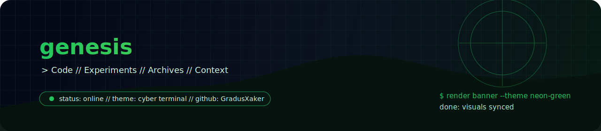

<div align="center">
  

  <h1>genesis</h1>
  <p><strong>Центральный архив и рабочая база проекта.</strong> Код, эксперименты и старые наработки собраны в одном месте.</p>

  <p>
    
    
    
  </p>
</div>

```text
> repo: genesis
> purpose: consolidate code + archives + context
> mode: one entry point for evolving project history
```

## обзор

`genesis` нужен как единая точка входа для связанных модулей и архивных подпроектов, чтобы не расползались контекст, код и история экспериментов.

## Что находится в репозитории

- актуальные части проекта и связанные модули;
- архивные подпроекты и старые версии, сохраненные для истории;
- рабочие материалы, которые раньше были распределены по нескольким репозиториям.

## Зачем это нужно

Репозиторий используется как единая точка входа для кода и материалов проекта `Genesis`, чтобы не терять контекст между старыми и новыми наработками.

## Структура

- `archived/` — старые или перенесенные подпроекты;
- остальные каталоги — актуальный код и связанные ресурсы.

## Примечание

Часть содержимого может относиться к разным этапам развития проекта и иметь разный уровень актуальности.

## контакты

<p>
  <a href="https://github.com/GradusXaker"></a>
  <a href="https://vk.com/gradus_xaker"></a>
  <a href="mailto:gradus_xaker@mail.ru"></a>
</p>

